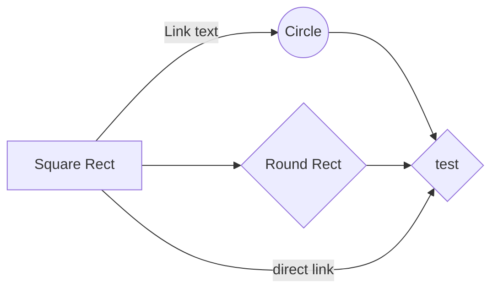

# Welcome to Campaigns 101!

# About this course

Here is a test

'''python
code test
'''

'''output
this is the output
'''

## Then, there are lists

-  **New file** 
- and bolding
- and italics (but I don't know how to do)

## Manage file publication

Since 

